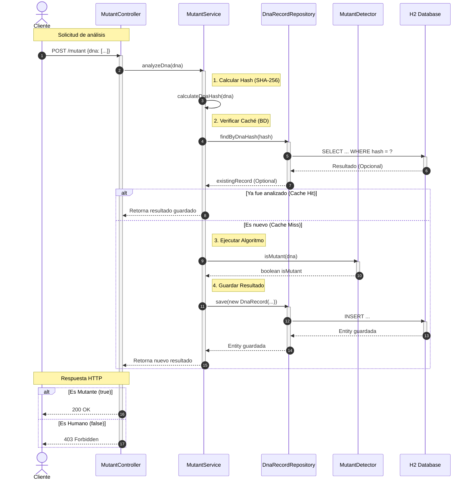

````markdown
# 🧬 Mutant Detector API

[](https://www.oracle.com/java/)
[](https://spring.io/projects/spring-boot)
[](https://gradle.org/)
[]()

> **Autor:** Valentina Luna
>
> API REST diseñada para detectar mutantes basándose en su secuencia de ADN. Proyecto desarrollado para el examen técnico de MercadoLibre (Backend Developer).

---

## 🚀 Deploy & Documentación

El proyecto se encuentra desplegado en **Render** y cuenta con documentación interactiva (Swagger UI).

- **🌐 URL Base:** `https://mutant-api-valentina-luna.onrender.com`
- **📄 Documentación Swagger:** `https://mutant-api-valentina-luna.onrender.com/swagger-ui.html`

---

## 🧩 El Problema

Magneto quiere reclutar la mayor cantidad de mutantes para su ejército. Este sistema permite detectar si un humano es mutante analizando su secuencia de ADN.

Un humano es **mutante** si se encuentran **más de una secuencia de cuatro letras iguales** (AAAA, TTTT, CCCC, GGGG) en direcciones:
- ➡ Horizontal
- ⬇ Vertical
- ↘ Diagonal

**Ejemplo de ADN Mutante:**
```json
{
  "dna": [
    "ATGCGA",
    "CAGTGC",
    "TTATGT",
    "AGAAGG",
    "CCCCTA",
    "TCACTG"
  ]
}
````

-----

## 🏗 Arquitectura y Diseño

El proyecto sigue una arquitectura en capas clásica para asegurar la escalabilidad y mantenibilidad:

1.  **Controller Layer:** Maneja las peticiones HTTP.
2.  **Service Layer:** Contiene la lógica de negocio (algoritmo de detección).
3.  **Repository Layer:** Interactúa con la base de datos (H2).
4.  **Model Layer:** Entidades y DTOs.

### Diagrama de Secuencia (Flujo de Análisis)

El siguiente diagrama muestra el flujo de una petición `POST /mutant`:



-----

## 🛠 Tecnologías

* **Lenguaje:** Java 17
* **Framework:** Spring Boot 3.2.0
* **Build Tool:** Gradle
* **Base de Datos:** H2 (In-memory)
* **Testing:** JUnit 5, Mockito, MockMvc
* **Contenedorización:** Docker
* **Documentación:** OpenAPI (Swagger)

-----

## 📡 API Endpoints

### 1\. Detectar Mutante

Verifica si una secuencia de ADN corresponde a un mutante.

* **URL:** `/mutant`
* **Método:** `POST`
* **Body:**
  ```json
  {
      "dna": ["ATGCGA","CAGTGC","TTATGT","AGAAGG","CCCCTA","TCACTG"]
  }
  ```
* **Respuestas:**
    * `200 OK`: Es mutante.
    * `403 Forbidden`: Es humano.
    * `400 Bad Request`: ADN inválido (caracteres erróneos, matriz no cuadrada, null).

### 2\. Estadísticas

Devuelve estadísticas de las verificaciones realizadas.

* **URL:** `/stats`
* **Método:** `GET`
* **Respuesta:**
  ```json
  {
      "count_mutant_dna": 40,
      "count_human_dna": 100,
      "ratio": 0.4
  }
  ```

-----

## 💻 Instalación y Ejecución Local

### Prerrequisitos

* Java 17
* Git

### Pasos

1.  **Clonar el repositorio:**

    ```bash
    git clone [https://github.com/valentinaluna14/ExamenMercado.git](https://github.com/valentinaluna14/ExamenMercado.git)
    cd ExamenMercado
    ```

2.  **Ejecutar la aplicación (Gradle):**

    ```bash
    ./gradlew bootRun
    ```

3.  **Probar:**
    Abrir `http://localhost:8080/swagger-ui.html` en tu navegador.

### Ejecutar con Docker

```bash
docker build -t mutant-api .
docker run -p 8080:8080 mutant-api
```

-----

## 🧪 Testing y Cobertura

El proyecto cuenta con una suite completa de tests unitarios y de integración.

* **Tests Totales:** 35+ tests.
* **Cobertura de Código:** 86% (Superando el objetivo del 80%).

Para ejecutar los tests y ver el reporte de cobertura:

```bash
./gradlew test jacocoTestReport
```

El reporte se generará en `build/reports/jacoco/test/html/index.html`.

-----

## 📚 Referencia del Examen

El enunciado original, las guías de evaluación y las instrucciones detalladas para estudiantes proporcionadas por la cátedra se encuentran disponibles en el archivo:

👉 **[GuiaCompletaEstudiantes.md](https://www.google.com/search?q=GuiaCompletaEstudiantes.md)**

````

